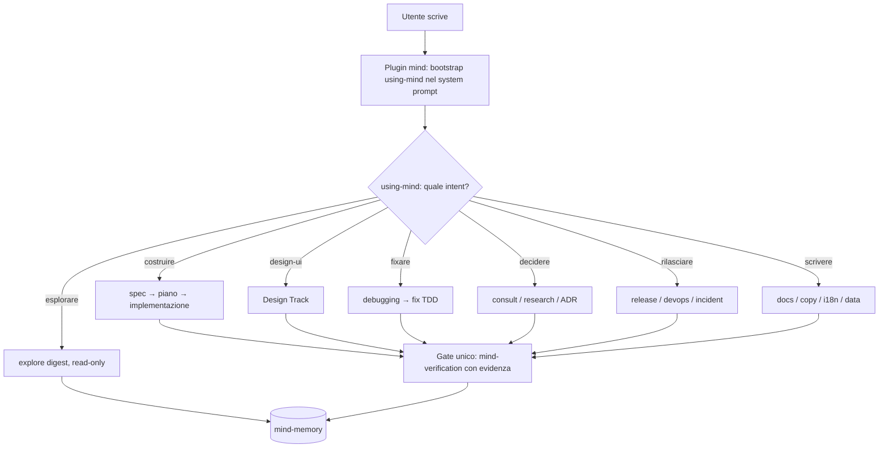
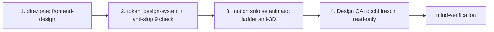

# mind-system

Sistema mind: skill + orchestrazione + memoria per **opencode**.

Orchestratore snello a 7 intenti, Design Track first-class, un solo gate di verifica, memoria locale-first. Funziona con DeepSeek, Qwen e Muse.

> I diagrammi sono **Mermaid** (GitHub li renderizza da solo).

## Versioni

| Versione | Dove | Cosa |
|---|---|---|
| **v2.0** (corrente, `main`) | questo repo | Orchestratore snello: 7 intenti, 5 precedenze, budget rigido, 1 gate |
| **v1.0** | [Releases](../../releases/tag/v1.0) | Sistema completo precedente (tabella ~50 rotte, 17 precedenze) — zip scaricabile |

La v1 resta scaricabile per sempre dalle Release. La storia completa è nei tag git (`v1.0` → `v2.0`).

## Struttura

- `skills/mind/` — il fork mind: orchestratore `using-mind` (`SKILL.md` + `routing.md` + `fma-agents.md`) e 46 skill di dominio
- `skills/<altre>` — skill storiche (context7-mcp, design-md, design-system, ecosystem-health-check, execution-hygiene, frontend-design, motion, orchestrator, stop-slop)
- `plugins/` — `mind.js` (inietta il bootstrap, registra skill, traccia l'uso in `gaps/skills-used.json`) e `mind-memory.js` (memoria locale-first). Vanno al top di `~/.config/opencode/plugins/`
- `config/` — `opencode.jsonc`, `mind-memory.json`, `AGENTS.md`, subagent custom (`agents/sage.md`, `lust.md`, `forge.md`). Chiavi API come placeholder `{env:VAR}` risolti dall'ambiente all'avvio
- `docs/` — appunti e note decisionali (in parte riferiti alla v1)
- `sync.ps1` — sincronizza **repo → macchina locale** (il repo è la source of truth)

## Quickstart

```powershell
git clone https://github.com/Kyriga-CGX/mind-system.git
cd mind-system
.\sync.ps1          # copia repo -> ~/.config/opencode + ~/.agents/skills (con .bak dei file esistenti)
# esporta le chiavi chieste da config (es. setx CONTEXT7_API_KEY "..."), poi riavvia opencode
```

Per aggiornare dopo un `git pull`: rilancia `.\sync.ps1`. Anteprima senza copiare: `.\sync.ps1 -WhatIf`.

## Come funziona



Ogni task dichiara la rotta in una riga (`INTENT=x → STAGE=… → GATE=verification`), delega alla prima skill e va a catena. Dettaglio in `skills/mind/using-mind/routing.md`.

## I 7 intenti

| # | Intent | Rotta | Quando |
|---|---|---|---|
| 1 | `costruire` | spec → piano → implementazione → verification | feature, lavoro creativo |
| 2 | `design-ui` | Design Track → verification | nuova UI, redesign, ritocco |
| 3 | `fixare` | debugging (root cause + test) → fix TDD → verification | bug, comportamenti inattesi |
| 4 | `esplorare` | explore (digest) → docs? → memoria | capire codice, onboarding, impatto |
| 5 | `decidere` | consult/research → ADR/piano → codice solo se approvato | architettura, librerie, strategia |
| 6 | `rilasciare` | release / devops / incident → verification | versioni, deploy, incidenti |
| 7 | `scrivere` | docs / copy / i18n / data → verification | testi, traduzioni, dati puntuali |

Se ambiguo: route conservativa (creativo→costruire, anomalia→fixare, domanda→decidere). Pipeline multi-stage **solo** se consegna unica + ≥3 stage + stato su file, altrimenti rotta singola.

## Design Track



Direzione estetica prima dei token, token prima del motion. `DESIGN.md` è la source of truth (token `var(--*)`, WCAG 4.5:1, catalogo ~80 brand OKLch). Il motion non salta mai al 3D se basta il 2D (3 strati, stagger <500ms). Chi implementa non si auto-valuta: la QA è read-only.

## Regole d'oro (le 5 precedenze)

1. Le istruzioni dell'utente vincono su tutto.
2. Sicurezza prima del codice (auth, dati sensibili, pagamenti, rete).
3. Design: direzione → token → motion.
4. Un task = una rotta; parallelo solo se i file sono disgiunti.
5. `mind-verification` è l'unico gate: niente è "fatto" senza evidenza.

Budget rigido: max 3 subagent paralleli, max 10 iterazioni, stop a 3 fail. Memoria mai bloccante: se vuota, si procede con i default e si segnala.

## Agenti

Subagent con nomi Fullmetal Alchemist (`fma-agents.md`): Edward/Alphonse/Armstrong/Lan Fan implementano, Scar fa debugging, Riza verifica, Roy arbitra, Van Hohenheim (sage) consiglia, Lust fa design QA, Sheska (forge) crea skill nuove. Verbo latino + emoji come firma.

## Memoria

`mind-memory`: retrieval lessicale locale su `memories.json` (non è RAG, niente embedding), scope `user`/`project`, cloud opzionale. A fine rotta si salvano pattern, decisioni ed errori. `mind-recall` interroga lo storico sessioni quando la memoria non basta.

## Sviluppo

- Lacuna di routing → correggi `routing.md`. Skill che rende male → `mind-eval`. Caso non coperto → `mind-forge` (mai creare senza approvazione utente).
- Rollback: ogni release è un tag; per tornare alla v1 scarica lo zip dalla [Release v1.0](../../releases/tag/v1.0).
