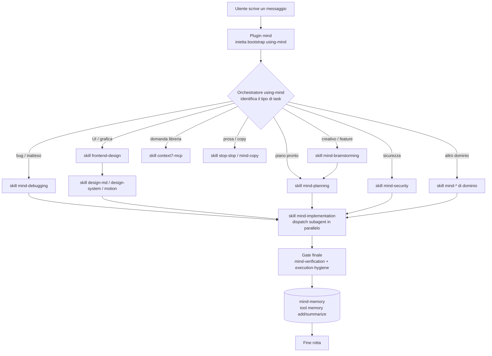
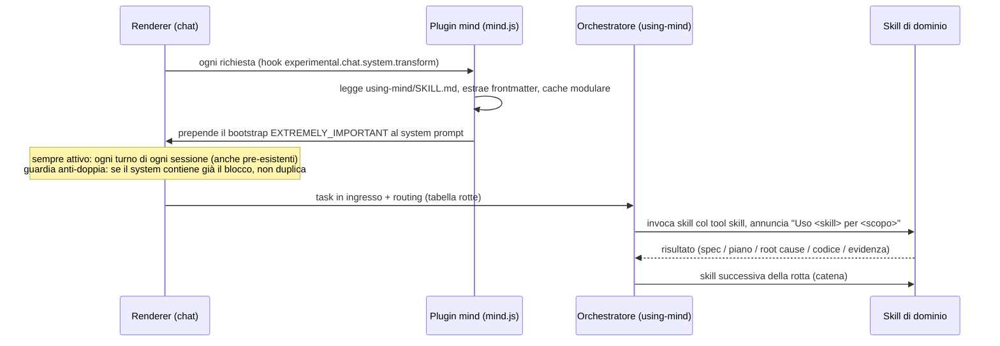
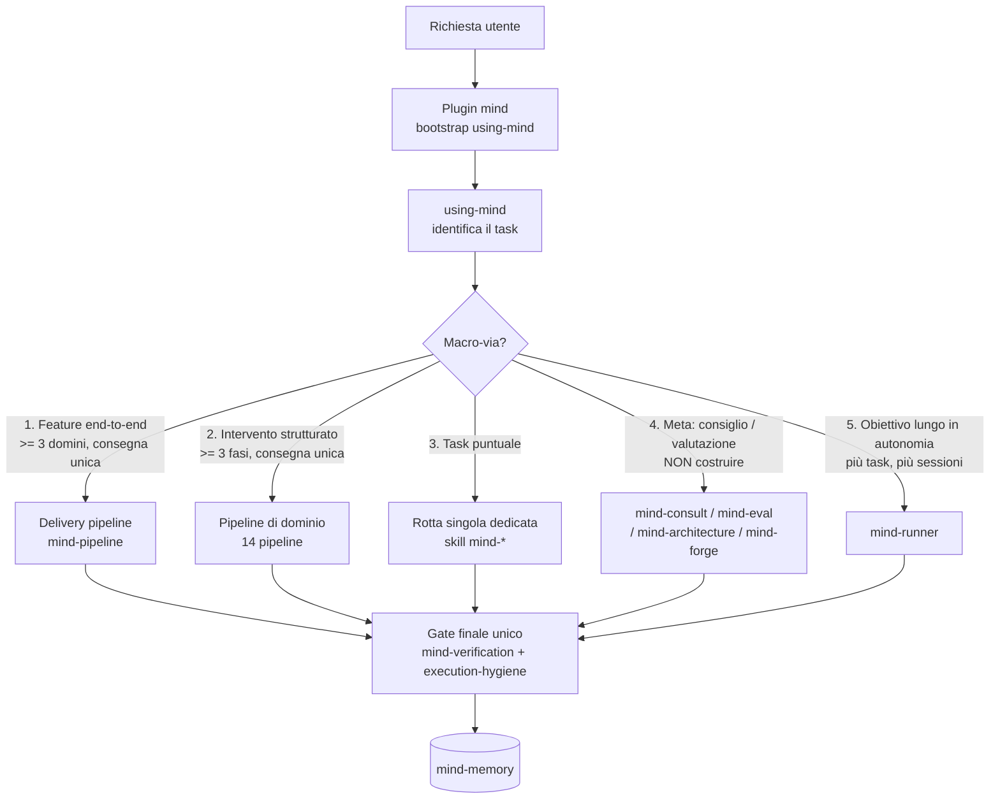
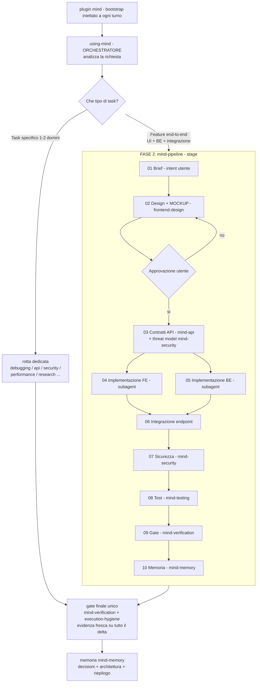
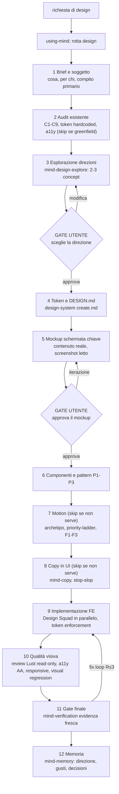
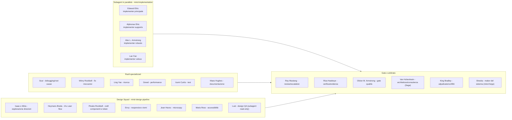
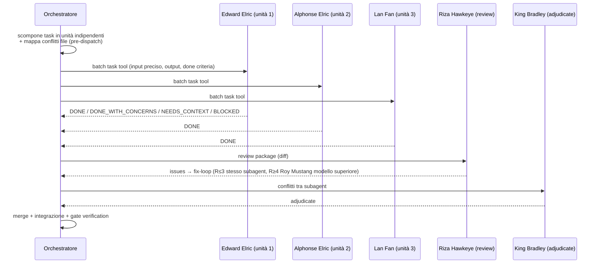
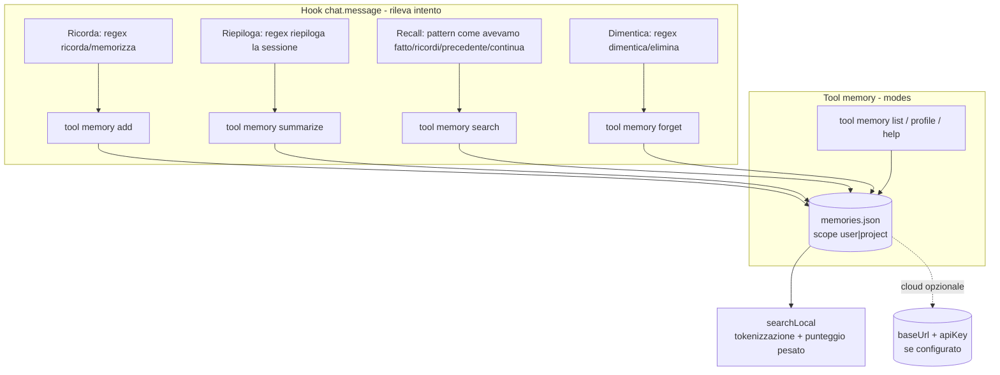
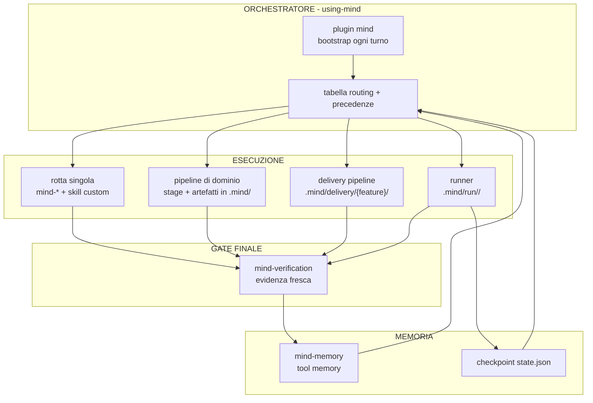

# mind-system

Sistema mind: skill + orchestrazione + memoria.

Sistema di skill completo per opencode: orchestrazione a 360° (routing intelligente delle skill), plugin `mind` (orchestratore) e plugin `mind-memory` (memoria locale-first con cloud opzionale), fork personale dei plugin originali che rallentavano l'avvio.

> I diagrammi di questo README sono **Mermaid** (renderizzati automaticamente da GitHub). Una copia estesa è in `docs/system-diagram.md`.

## Struttura

- `config/` — configurazione opencode (`opencode.jsonc`, `mind-memory.json`, `vibeguard.config.json`, `dcp.jsonc`, `AGENTS.md`) e `config/agents/` con i subagent custom: `sage.md` (Van Hohenheim — consulenza/ragionamento/strategia, read-only sul codice), `lust.md` (Lust — design QA, review visiva read-only) e `forge.md` (Sheska — maker dell'orchestrazione, forgia nuove skill/agenti per colmare lacune). Le chiavi API sono sostituite con placeholder `{env:VAR}` (es. `CONTEXT7_API_KEY`), risolti dall'ambiente del processo all'avvio di opencode — NON `${VAR}` e NON auto-load di `.env` (feature non ancora nativa, vedi issue #10458).
- `plugins/` — plugin locali fork personali: `mind.js` (orchestratore, inietta il bootstrap, registra le skill e traccia l'uso delle skill/subagent) e `mind-memory.js` (memoria locale-first). Vanno copiati **al livello top** di `~/.config/opencode/plugins/` (non in sottocartelle): opencode li auto-carica da lì, senza bisogno di voci `file:` nel config.
- `skills/` — skill custom dell'agente: il fork `mind/` con l'orchestratore `using-mind` e 46 skill di dominio, più le skill storiche (context7-mcp, design-md, design-system, ecosystem-health-check, execution-hygiene, frontend-design, motion, orchestrator, stop-slop). Le directory node_modules sono escluse.
- `docs/` — documentazione e note decisionali, incluso `system-diagram.md`.

> La memoria supermemory non è più usata: sostituita dal plugin locale `mind-memory` (storage in `~/.local/share/opencode/mind-memory/memories.json`, cloud opzionale disattivato se non configurato).

## Diagramma del flusso

### Flusso complessivo (attivazione → routing → esecuzione → gate → memoria)



**Catena tipica**: `brainstorming` → spec → `planning` → piano → `implementation` (subagent FMA in parallelo) → `verification` (evidenza) → `mind-memory` (memoria).

### Attivazione (bootstrap del plugin)



- Il plugin **mind** fa 3 cose: registra la dir skill in `config.skills.paths`, inietta il bootstrap nel system prompt a ogni turno e traccia l'uso di skill/subagent in `~/.config/opencode/mind/gaps/skills-used.json` (registratore per il gate di sessione di mind-forge). Nessuna rete, nessun update-check (motivo: niente lentezza all'avvio).
- Il plugin **mind-memory** è locale-first: legge `mind-memory.json` (cloud opzionale), storage in `~/.local/share/opencode/mind-memory/memories.json`.

## Struttura dell'orchestratore

L'orchestratore è la skill `using-mind` (cartella `skills/mind/using-mind/`), iniettata a ogni turno dal plugin `mind`. È composto da 3 file con responsabilità separate:

| File | Responsabilità |
|---|---|
| `SKILL.md` | regole di routing, precedenze, gate e sequenza, comunicazione tra skill, principi, proattività |
| `routing.md` | tabella rotte completa, casi limite, output attesi per ogni rotta, fonti esterne |
| `fma-agents.md` | agenti (personaggi FMA), ruolo per ogni subagent, battute anime |

Ogni richiesta viene classificata PRIMA in una di **5 macro-vie**, poi instradata alla rotta/pipeline specifica:



Regole d'oro: le macro-vie 1 e 2 non scattano mai per task puntuali (→ 3); la 4 mai per costruire codice (→ 3), ma la sua sotto-via `mind-forge` può generare **skill/agenti del sistema** (non codice prodotto); la 5 mai per un singolo task (→ 3). In caso di dubbio → rotta conservativa.

**Artefatti come link cliccabili**: ogni file citato all'utente (mockup, screenshot, report, spec, digest, documento) è presentato come hyperlink markdown `file://` assoluto, es. `[apri mockup](file:///F:/OpenCode%20Project/.../docs/mockups/nome.html)`. Nell'app desktop opencode si apre con **Ctrl+click** (Cmd su macOS): niente path nudi da cercare a mano.

## Routing completo (come si attiva ogni skill)

| Tipo di task | Rotta (in ordine) | Si attiva quando... |
|---|---|---|
| Nuova feature / creativo | `mind-brainstorming` → `mind-planning` → `mind-implementation` → `mind-verification` | task nuovo, vago, da progettare |
| Feature end-to-end (UI + BE + integrazione + sicurezza, consegna unica) | `mind-pipeline` (stage: mockup→approvazione→contratti→FE→BE→integrazione→sicurezza→test→gate→memoria; artefatti in `.mind/delivery/<feature>/`) | ≥3 domini in sequenza con una consegna |
| App mobile cross-platform (dallo stack allo store) | `mind-mobile-pipeline` (stack→design mobile→contratti→FE→BE→device/push→test→build+signing→release→gate) | app mobile end-to-end con consegna su store |
| Feature semplice ben definita | `mind-planning` → `mind-implementation` → `mind-verification` | requisiti già chiari |
| UI (costruire/modificare) | `frontend-design` → `design-md` (solo se manca DESIGN.md) → `design-system` → `motion` (solo animazioni) → `mind-verification` | tocca interfaccia/grafica |
| UI (solo ritocco stile) | `design-system` → `mind-verification` | piccola modifica stile |
| Animazione / motion / 3D | `motion` → `frontend-design` (se serve direzione) → `mind-verification` | tocca animazioni/3D |
| Prosa / testi (pulizia) | `stop-slop` | rimuovere pattern AI |
| Copywriting (creazione) | `mind-copy` → `stop-slop` → (`frontend-design` se in UI) → `mind-verification` | scrivere testi nuovi |
| Bug / comportamento inatteso | `mind-debugging` → `mind-implementation` (TDD) → `mind-verification` | comportamento sbagliato |
| Bug hunting proattivo | `mind-debugging` (sezione bug hunting) → `mind-testing` → `mind-verification` | review difensiva |
| Sicurezza / breach | `mind-security` → `mind-implementation` (fix) → `mind-verification` | auth, dati sensibili, rete |
| Ricerca / scelta libreria | `mind-research` (→ `context7-mcp`) | comparazione con fonti |
| Ricerca approfondita con evidenza | `mind-research-pipeline` (domanda+criteri→fonti→sintesi per opzione→comparazione→raccomandazione→validazione) | ricerca con raccomandazione documentata |
| Performance | `mind-performance` (misura PRIMA) → `mind-implementation` → `mind-verification` | lentezza/carico |
| Intervento performance strutturato | `mind-performance-pipeline` (baseline→profiling→collo di bottiglia→ottimizzazione→verifica→monitoraggio) | intervento strutturato su lentezza/carico/bundle/query |
| Dati / database / ETL | `mind-data` → (`mind-implementation` se codice) → `mind-verification` | query/schema/dati |
| Task dati/ETL complesso | `mind-data-pipeline` (estrazione→pulizia→validazione→trasformazione→caricamento→verifica→documentazione) | movimento dati con trasformazioni |
| Ciclo machine learning completo (dati→modello→servizio) | `mind-ml-pipeline` (problema+metrica→dati→feature→modello→training→eval→deploy→monitoraggio drift) | modello, predizione, ML |
| Test | `mind-testing` → `mind-verification` | strategia/scrittura test |
| Documentazione | `mind-docs` → `mind-verification` | README/API/guide |
| Migrazione / upgrade | `mind-migration` → `mind-implementation` → `mind-verification` | cambio stack/versioni |
| Migrazione complessa (stato A→B) | `mind-migration-pipeline` (analisi delta→piano incrementale→dry-run→migrazione a fasi→verifica→cutover→monitoraggio) | migrazione con rollback e cutover |
| Ritiro sicuro di servizio/feature attivo (rimozione totale) | `mind-decommission-pipeline` (inventario consumatori→deprecation→avvisi→migrazione→shutdown→cleanup) | "spegniamo", "togliamo", decommission |
| Design strutturato: nuova UI, redesign completo, identità visiva, design system da zero | `mind-design-pipeline` (brief→audit→direzioni→DESIGN.md→mockup→componenti→motion→copy→FE→qualità visiva→gate→memoria) | "progetta la UI", "ridisegna", "nuova identità visiva" |
| Scelta della direzione estetica (servono 2-3 concept prima di costruire) | `mind-design-explore` (direzioni distinte + auto-check anti-slop + comparazione + scelta utente) | "voglio 2-3 proposte", "definisci il look" |
| Refactoring (no stack change) | `mind-refactor` → `mind-verification` (→ `mind-debugging`/`mind-migration` se emerge) | pulire/riorganizzare codice |
| API / contratti | `mind-api` → (`mind-security` se auth) → `mind-implementation` → `mind-verification` | endpoint/consumo terze parti |
| Deploy / CI-CD / infra | `mind-devops` → `mind-verification` | build/deploy/pipeline |
| Infrastruttura cloud / ambiente end-to-end (provisioning→rete→secrets→container→deploy→DNS) | `mind-infra-pipeline` (scope→IaC→rete/security→secrets→immagini→orchestrazione→DNS/cert→scaling→costi→monitoraggio) | setup ambiente, provisioning, deploy cloud |
| Osservabilità di un sistema (log/metriche/tracing/alert/dashboard) | `mind-observability-pipeline` (inventario→logging→metriche→tracing→alerting→dashboard/SLO→verifica) | monitoraggio, telemetria, alerting |
| Release / versioning | `mind-release` → `mind-devops` → `mind-verification` | versione/changelog/tag |
| Release completa a stage | `mind-release-pipeline` (analisi cambiamenti→versioning→changelog→build+test CI→tag→publish→rollback plan) | chiusura ciclo feature→deploy |
| Rilascio graduale di feature già pronta (flag/canary/A-B, misurazione) | `mind-feature-rollout-pipeline` (flag design→metriche+b baseline→canary→A/B→espansione→rollout completo→post-verifica) | "metti dietro flag", "canary", "A/B test", "accendi la feature" |
| Comprendere codice sconosciuto | `mind-explore` (digest) → (`mind-docs` se da documentare) → `mind-memory` | onboarding/impatto cambio |
| Decisione architetturale | `mind-brainstorming` (spec) → `mind-architecture` (ADR) → `mind-planning` | ADR, trade-off di design |
| Incidente in produzione | `mind-incident` → (`mind-debugging`/`mind-security`/`mind-devops`) → `mind-docs` (postmortem) → `mind-verification` | servizio giù/degrado |
| Incidente/breach complesso (risposta strutturata) | `mind-incident-pipeline` (detection→triage→mitigazione→root cause→verifica stabilità→postmortem→hardening) | incidente strutturato a stage, breach |
| Audit di sicurezza completo | `mind-security-audit-pipeline` (scope→threat model→input→auth/authz→dipendenze→test attivi→report→remediation) | audit sistema/area, pre-release, post-breach |
| Localizzazione / i18n | `mind-i18n` → `mind-implementation` → `mind-testing` → `mind-verification` | lingue/traduzioni/RTL |
| Valutare prompt/agent/skill | `mind-eval` (report) → l'orchestratore applica le modifiche | testare il sistema stesso |
| Colmare una lacuna dell'orchestrazione | `mind-forge` (diagnosi→proposta con gate→crea skill/agente→registra nel routing→`mind-eval`) via subagent `forge` (Sheska) | nessuna skill copre un caso ricorrente |
| Piano multi-step | `mind-planning` → `mind-implementation` → `mind-verification` | piano pronto |
| Obiettivo complesso / piano da eseguire per intero in autonomia (multi-sessione, "finisci da solo") | `mind-runner` (coda persistente + loop + checkpoint + gate verde) | lavoro lungo da portare a termine senza conferma a ogni task |
| Domanda libreria/framework | `context7-mcp` | domanda diretta |
| Consulenza / ragionamento / strategia / confronto / valutazione (NON costruire) | `mind-consult` (via subagent `sage` = Van Hohenheim) | "cosa mi consigli", "come miglioreresti", decisioni |
| Init progetto | `ecosystem-health-check` → `mind` (routing) → `design-md`/`design-system` (se UI) | nuovo progetto |
| Onboarding progetto nuovo / codebase sconosciuto | `mind-onboarding-pipeline` (setup→digest→convenzioni→architettura→baseline test→primi task) | acquisizione contesto prima di lavorare |
| Review codice | `mind-implementation` (review+fix-loop) / `mind-verification` | PR/review |
| Richiamo lavoro precedente | `memory` tool (search) via `mind-memory` | "come avevamo fatto..." |
| Richiamo con storico completo | `memory` search → `mind-recall` (storico sessioni, sola lettura) | la memoria non basta, serve lo storico |
| Prima configurazione / progetto nuovo | `mind-setup` (domande una alla volta → working-set) → rotta del task | primo messaggio senza config salvata |
| Documenti (PDF/DOCX/XLSX/PPTX) | `mind-documents` → (`mind-copy` per il testo) → `mind-verification` | file documento |
| Git workflow / branch / commit / worktree | `mind-git` → `mind-verification` | versionamento, PR, parallelismo |
| Riepilogo sessione | `memory` tool (summarize) via `mind-memory` | "riepiloga la sessione" |
| Salvataggio preferenza/contesto | `memory` tool (add) via `mind-memory` | "ricorda che..." |

**Precedenze chiave**:
1. `mind`/`using-mind` è l'entry point, decide la rotta (mai le skill da sole).
2. Process skill PRIMA (brainstorming/debugging impostano l'approccio), skill di contenuto DOPO.
3. `frontend-design` PRIMA di `design-system` e `motion`.
4. `mind-security` PRIMA di qualsiasi codice che tocca auth/dati sensibili/rete.
5. `mind-verification` + `execution-hygiene` SEMPRE gate finale.
6. Le istruzioni utente (AGENTS.md, richieste dirette) prevalgono sulle skill.
7. Skill di dominio entrano SOLO se il task tocca quel dominio.
8. `mind-setup` è il gate iniziale su progetto nuovo; `mind-recall` è il fallback del richiamo (dopo `memory` search); gli MCP si invocano SOLO on-demand, mai all'avvio.
9. `mind-runner` entra SOLO per un piano/obiettivo da eseguire per intero in autonomia (più task, possibilmente più sessioni). Un task singolo NON usa il runner.
10. `mind-consult` (subagent `sage`) entra SOLO per domande meta/consultive — pensare, consigliare, decidere — non per costruire/modificare codice. Se il parere sfocia in lavoro, si torna alla rotta di implementazione.
11. `mind-forge` (subagent `forge` = Sheska) entra SOLO per una lacuna di COPERTURA del sistema con evidenza (richiesta esplicita, registratore `.mind/gaps/skills-used.json`, richieste fuori-rotta). Lacuna di routing → correggi il routing; lacuna di qualità → `mind-eval`. Non crea nulla senza approvazione utente.
11. `mind-pipeline` entra SOLO per feature end-to-end (≥3 domini in sequenza con consegna unica: UI+BE+integrazione). Task singoli o 1-2 domini usano la rotta specifica, NON la pipeline.
12. Le pipeline di dominio (incident-pipeline, security-audit-pipeline, migration-pipeline, release-pipeline, onboarding-pipeline, research-pipeline, data-pipeline, performance-pipeline, mobile-pipeline, infra-pipeline, observability-pipeline, ml-pipeline, feature-rollout-pipeline, decommission-pipeline) entrano SOLO per interventi strutturati a stage con ≥3 fasi e consegna unica. Un intervento puntuale usa la rotta singola dedicata (incident/security/migration/release/research/data/performance/devops), NON la pipeline.
13. `mind-design-pipeline` entra SOLO per un lavoro di design strutturato con consegna visiva (nuova UI, redesign completo, identità visiva, design system da zero): ≥3 fasi di design e almeno una schermata da consegnare. Il ritocco puntuale usa la rotta UI singola; la feature con BE ed endpoint usa `mind-pipeline` (che chiama la design pipeline come suo Stage 2). `mind-design-explore` entra quando manca una direzione approvata e il brief non la fissa. La review visiva finale va al subagent `lust` (read-only), MAI a chi ha implementato.

**Casi limite**: UI+BE → rotta del dominio predominante, gate unico. Dubbio → route conservativa. Fix rapido di bug già investigato → salta `mind-debugging`. Refactor vs migration → senza cambio stack = refactor. Copy vs pulizia → creare = `mind-copy`, pulire = `stop-slop`. Incident vs bug → produzione giù = `mind-incident`. Richiamo vs recall → prima `memory` search, poi `mind-recall`. Documenti vs codice → file .pdf/.docx/.xlsx/.pptx = `mind-documents`. Runner vs task singolo → un obiettivo/piano da portare a termine in autonomia = `mind-runner`; un singolo task = rotta specifica. Consulenza vs costruzione → "cosa mi consigli / come miglioreresti / è una buona idea" = `mind-consult` (subagent `sage`); se il consiglio sfocia in lavoro → rotta normale; se valuta il sistema → `mind-eval`; se è una decisione architetturale → `mind-architecture`. Pipeline vs rotta specifica → feature che attraversa UI+BE+integrazione+sicurezza con consegna unica = `mind-pipeline`; task di 1-2 domini = rotta dedicata; se la feature ha UI, il mockup va approvato dall'utente PRIMA del codice. Pipeline di dominio vs rotta singola → incidente/audit/migrazione/release/onboarding/ricerca/ETL/performance STRUTTURATO a stage (≥3 fasi, consegna unica) = pipeline di dominio; un intervento puntuale (singola vulnerabilità, singola migrazione, singola release, query dati, micro-ottimizzazione, bug di sviluppo, singolo deploy, singolo endpoint) = rotta singola dedicata. Mobile vs web → app mobile cross-platform = `mind-mobile-pipeline`; solo web = `mind-pipeline`; solo release su store di app già pronta = `mind-release-pipeline`. Design strutturato vs ritocco vs feature → nuova UI/redesign/identità visiva/design system da zero con consegna visiva = `mind-design-pipeline`; ritocco puntuale o modifica di una schermata esistente = rotta UI singola (`frontend-design` → `design-system` → `motion` se animazioni); feature con UI+BE+endpoint = `mind-pipeline`; solo token mancanti = `design-system` (create.md). Direzione già fissata vs da esplorare → il brief fissa la direzione visiva = `frontend-design` + `design-md`/`design-system` (le parole del brief vincono); direzione da scegliere = `mind-design-explore` con 2-3 direzioni e gate utente (una sola proposta = falsa scelta). Chi giudica il design → chi implementa NON si auto-valuta esteticamente: review in contesto fresco con il subagent `lust` (read-only), poi gate `mind-verification`. Lacuna del sistema (forge) → manca una capacità (nessuna skill copre un caso ricorrente; il registratore mostra sessioni fuori-rotta o skill mai usate) = `mind-forge` (diagnosi→proposta con gate→crea skill/agente→registra nel routing→`mind-eval`); lacuna di routing (skill ignorata) = correggi la tabella; lacuna di qualità (skill scadente) = `mind-eval`; mai creare senza approvazione utente, mai duplicare una skill esistente. Infra vs release → creare/modificare l'AMBIENTE = `mind-infra-pipeline`; pubblicare il CODICE in ambiente esistente = `mind-release`. Osservabilità vs incidente → costruire il monitoring = `mind-observability-pipeline`; incidente in corso senza visibilità = `mind-incident-pipeline` prima, poi observability come hardening. ML vs data → ciclo ML completo = `mind-ml-pipeline`; solo movimento/trasformazione dati = `mind-data-pipeline`; solo scelta libreria ML = `mind-research`. Rollout vs release → attivare GRADUALMENTE una feature già pronta (flag/canary/A-B, misurata) = `mind-feature-rollout-pipeline`; pubblicare una versione = `mind-release-pipeline` (la release include il flag default off, il rollout lo accende). Decommission vs migration → RIMUOVERE del tutto = `mind-decommission-pipeline`; SOSTITUIRE = `mind-migration-pipeline`; deprecation di un singolo endpoint = `mind-api`.

## Pipeline di consegna (`mind-pipeline`)

Per le feature end-to-end (UI + BE + integrazione + sicurezza) l'orchestratore usa una **pipeline a stage** che attraversa i domini in sequenza, con approvazioni ai punti critici e artefatti condivisi in `.mind/delivery/<feature>/`. Gli agenti comunicano SCRIVENDO/LEGGENDO i file della cartella (mai rigirandosi l'intera conversazione): ogni stage consuma solo l'artefatto del precedente.



## Pipeline di dominio (14)

Oltre alla consegna di feature, il sistema ha **14 pipeline di dominio** per interventi strutturati a stage (≥3 fasi, consegna unica). Un intervento puntuale usa la rotta singola dedicata, NON la pipeline. Ogni pipeline mantiene stato condiviso su file, gate tra gli stage e budget di chiamate.

| Pipeline | Stage | Trigger |
|---|---|---|
| `mind-incident-pipeline` | detection → triage (SEV1/2/3) → mitigazione (rollback→flag→workaround→fix) → root cause → verifica stabilità → postmortem → hardening | incidente/breach in produzione strutturato |
| `mind-security-audit-pipeline` | scope → threat model STRIDE → analisi input → auth/authz → dipendenze → test attivi → report (4 tipologie) → remediation | audit sicurezza di un sistema/area, pre-release, post-breach |
| `mind-migration-pipeline` | analisi delta → piano incrementale con rollback → dry-run → migrazione a fasi (commit per fase) → verifica dati/comportamento → cutover → monitoraggio post | migrazione complessa (stato A→B) |
| `mind-release-pipeline` | analisi cambiamenti → semantic versioning → changelog (Keep a Changelog) → build+test CI → tag annotato → publish → rollback plan | chiusura ciclo feature→deploy |
| `mind-onboarding-pipeline` | setup (domande una alla volta) → digest (timebox 30-45min) → convenzioni → architettura ADR → baseline test → primi task | progetto nuovo / codebase sconosciuto |
| `mind-research-pipeline` | domanda+criteri → fonti (context7-mcp) → sintesi per opzione → comparazione (criteri×opzioni) → raccomandazione → validazione | ricerca approfondita con raccomandazione documentata |
| `mind-data-pipeline` | estrazione → pulizia → validazione → trasformazione → caricamento (backup PRIMA, transazione, idempotente) → verifica pre/post → documentazione | task dati/ETL complesso |
| `mind-performance-pipeline` | baseline (misura PRIMA) → profiling → collo di bottiglia → ottimizzazione (una variabile per volta) → verifica (stesso strumento) → monitoraggio | intervento performance strutturato |
| `mind-mobile-pipeline` | stack (context7-mcp) → design mobile (frontend-design, HIG/M3) → contratti (mind-api) → FE mobile → BE → device/push/storage/offline → test (emulatori+device) → build+signing → release (rollback) → gate+memoria | app mobile cross-platform dallo stack allo store |
| `mind-infra-pipeline` | scope (provider/budget/compliance) → provisioning IaC → rete/security → secrets → immagini/container → orchestrazione → DNS/cert → scaling/resilienza → costi → monitoring | setup ambiente, provisioning, deploy cloud |
| `mind-observability-pipeline` | inventario → logging centralizzato → metriche (RED/USE) → tracing → alerting → dashboard/SLO → verifica → gate | osservabilità/monitoring/telemetria di un sistema |
| `mind-ml-pipeline` | problema+metrica → dati (split) → cleaning/feature (leakage) → selezione modello → training (riproducibile) → eval (test set, fairness) → deploy servizio → monitoraggio drift | modello, predizione, classificazione, ML |
| `mind-feature-rollout-pipeline` | flag design (default off) → metriche con baseline PRIMA → canary → A/B → espansione 25→50→100% → rollout completo (cleanup) → post-verifica | attivare gradualmente una feature già pronta, canary, A/B |
| `mind-decommission-pipeline` | inventario consumatori → valutazione impatto → piano deprecation (periodo) → avvisi/docs → migrazione → shutdown controllato → cleanup → gate | ritirare/spegnere un servizio o feature attivo |

## Design pipeline (`mind-design-pipeline`)

Quando la richiesta è un lavoro di design strutturato (nuova UI, redesign completo, identità visiva, design system da zero), l'orchestratore apre la design pipeline: 12 stage con artefatti in `.mind/design/<progetto>/` e DUE gate di approvazione utente (direzione e mockup).



**Regole**: nessun codice di produzione prima del mockup approvato; gate anti-slop C1-C9 PRIMA dei pattern di maturità (P1-P3) e di freschezza (F1-F3); `DESIGN.md` è la fonte di verità (hex hardcoded e px letterali = difetto); screenshot invece di rilettura del codice; skip solo per assenza di dominio; interruzioni all'utente solo ai due gate.

### Design Squad (subagent della design pipeline)

| Ruolo del subagent | Personaggio FMA | Si attiva quando... |
|---|---|---|
| Esplorazione direzioni / divergenza visiva | Isaac e Miria | servono 2-3 concept distinti (Stage 3) |
| Architettura dell'informazione / user flow | Heymans Breda | struttura, sequenze, priorità dei contenuti |
| Craft componenti / token | Pinako Rockbell | componenti su misura agganciati al DESIGN.md |
| Responsive / temi / dark mode | Envy | stessa identità su ogni forma e breakpoint |
| Microcopy / voce UI | Jean Havoc | CTA, errori, empty states, label |
| User advocate / accessibilità | Maria Ross | contrasto, focus da tastiera, label, nessuno escluso |
| Design QA / review visiva | Lust (`config/agents/lust.md`) | review read-only in contesto fresco: C1-C9, token, a11y, responsive, pattern dichiarati vs applicati |

## Agenti FMA — come vengono chiamati e quando



| Ruolo del subagent | Personaggio FMA | Verbo (spinner) | Emoji | Si attiva quando... |
|---|---|---|---|---|
| Implementer principale | Edward Elric | `aequiparo` | ⚗️ | default dell'implementazione |
| Implementer di supporto | Alphonse Elric | `protego` | 🛡️ | secondo implementer in parallelo |
| Implementer robusto/meccanico | Alex Louis Armstrong | `fabricor` | 💪 | task pesanti multi-file |
| Implementer veloce/leggero | Lan Fan | `percurro` | 🌀 | task piccoli e rapidi |
| Fix meccanici | Winry Rockbell | `calibro` | 🔧 | riparazioni puntuali |
| Debugging / root cause | Scar | `disicio` | 💥 | analisi distruttiva-creativa |
| Ricerca / comparazione | Ling Yao | `exploro` | 🐉 | `mind-research` |
| Ottimizzazione | Greed | `accumulo` | 💰 | `mind-performance` |
| Review / escalation | Roy Mustang | `inuro` | 🔥 | fix-loop R≥4, review del diff |
| Verifica / evidenza | Riza Hawkeye | `recenseo` | 🎯 | `mind-verification` |
| Test rigorosi | Izumi Curtis | `exigo` | 🌊 | `mind-testing` |
| Documentazione | Maes Hughes | `adnoto` | 📓 | `mind-docs`, report |
| Gate / qualità severa | Olivier Mira Armstrong | `obsigno` | ❄️ | gate finale |
| Architettura / visione / consulenza (Sage) | Van Hohenheim | `pondero` | 🧭 | design, pianificazione, domande meta/consultive (mind-consult) |
| Maker del sistema / forgia skill e agenti | Sheska | `compilo` | 📚 | `mind-forge`, colmare lacune di copertura (subagent `config/agents/forge.md`) |
| Arbitro finale / adjudicate | King Bradley | `dirimo` | ⚔️ | conflitti tra subagent |
| Esplorazione direzioni di design | Isaac e Miria | `divago` | 🎨 | Stage 3 di `mind-design-pipeline` |
| Architettura dell'informazione / user flow | Heymans Breda | `dispono` | 🗺️ | struttura e sequenze dei contenuti |
| Craft componenti / token | Pinako Rockbell | `elaboro` | 🛠️ | componenti agganciati al DESIGN.md |
| Responsive / temi / dark mode | Envy | `transformo` | 🦎 | ogni breakpoint e tema |
| Microcopy / voce UI | Jean Havoc | `dico` | 💬 | Stage 8 con `mind-copy` |
| User advocate / accessibilità | Maria Ross | `protego` | ♿ | contrasto, focus, label (Stage 10) |
| Design QA / review visiva (read-only) | Lust | `scrutor` | 👁️ | subagent dedicato `config/agents/lust.md`, review in contesto fresco |

**Regole**: il nome del personaggio è usato OGNI volta che si dispatcha un subagent (rotazione), nel prompt e nel report (`**Edward Elric** (implementer): DONE`). Ogni agente ha un **verbo/spinner** unico, **sempre in latino** (1ª persona singolare, presente indicativo: `…Edward aequiparo…`, `…Riza recenseo…`) e una **emoji-signature** (`⚗️ Edward`, `👁️ Lust`): il verbo sostituisce il generico "sto pensando" e rende visibile CHI sta agendo, l'emoji è la firma visiva che sopravvive agli aggiornamenti dell'app. Il latino dà uniformità ai verbi e li distingue dal linguaggio normale. **Ogni tanto** (non sempre) si apre il prompt/report con una battuta dell'anime (elenco in `fma-agents.md`), max una per subagent, coerente col contesto.

**Flusso di esecuzione parallela**:


## Memoria (mind-memory)



**Dettagli**:
- **Storage**: file JSON `~/.local/share/opencode/mind-memory/memories.json` — struttura `{memories:[{id, content, scope, type, title, metadata, createdAt, updatedAt}]}`. Niente BOM (UTF-8 puro).
- **Scope**: `user` (preferenze globali) / `project` (contesto di progetto).
- **Search locale**: tokenizzazione (lowercase + NFD senza accenti + split), punteggio pesato (token esatto = 1, substring = 0.5), sort per score poi updatedAt desc, top N (default 5).
- **Cloud (opzionale)**: solo se `mind-memory.json` ha `baseUrl` E `apiKey`; timeout 5s, errori silenziosi, mai bloccante. In questo repo è locale-only.
- **Auto-memory**: a fine rotta, le skill salvano pattern, decisioni, errori superati e architettura (tool `memory` add).
- **Recall intelligente**: quando l'utente dice "come avevamo fatto...", "ricordi...", "continua/riprendi..." → il plugin inietta una directive sintetica che impone di cercare nelle memorie PRIMA di rispondere.

### RAG?

**Non è RAG.** `mind-memory` fa **retrieval lessicale locale** (parole chiave + punteggio pesato), non embedding/vector DB. Un vero RAG richiederebbe un motore vettoriale (es. ChromaDB, Qdrant) con indicizzazione semantica: non c'è. Se in futuro si volesse RAG, si aggiungerebbe un motore di embedding locale (es. `@xenova/transformers` o SQLite-vec) mantenendo l'interfaccia del tool `memory` invariata. L'unico "recall" è la ricerca pesata su file JSON + cloud opzionale non configurato.

## Comunicazione tra skill (richiami)

| Da | A | Cosa passa |
|---|---|---|
| `mind-brainstorming` | `mind-planning` | spec approvato (`docs/specs/...`) |
| `mind-planning` | `mind-implementation` | piano (header + task) |
| `mind-debugging` | `mind-implementation` | root cause + test che fallisce |
| `mind-security` | `mind-implementation` | threat model e vettori |
| `mind-research` | `mind-planning`/`implementation` | raccomandazione con fonti |
| `mind-performance` | `mind-implementation` | baseline + collo di bottiglia |
| `mind-data` | `mind-implementation` | schema/query/analisi verificate |
| `mind-testing` | `mind-implementation` | strategia + test (TDD) |
| `mind-migration` | `mind-implementation` | delta + punto di rollback |
| `mind-refactor` | `mind-debugging`/`mind-migration` | bug emerso / upgrade necessario |
| `mind-refactor` | `mind-testing` | rete di sicurezza (baseline verde) |
| `mind-api` | `mind-security`/`docs`/`migration` | threat model / contratto / breaking change |
| `mind-release` | `mind-devops`/`mind-verification` | build/publish / gate build+test |
| `mind-explore` | `mind-docs`/`mind-memory` | Codebase Digest → docs/mappa |
| `mind-architecture` | `mind-planning`/`api`/`security`/`migration` | ADR come vincolo |
| `mind-copy` | `stop-slop`/`frontend-design`/`memory` | creazione → pulizia → estetica → tono |
| `mind-incident` | `debugging`/`security`/`devops`/`docs` | root cause / breach / rollback / postmortem |
| `mind-i18n` | `implementation`/`testing`/`verification` | chiavi/struttura → test per lingua → evidenza |
| `mind-eval` | orchestratore | report → modifiche sistema (eval prima/dopo) |
| `mind-forge` | orchestratore/`recall`/`eval`/routing | lacuna con evidenza → proposta (gate) → skill/agente nuovo → registrazione rotta → verifica eval |
| `mind-incident-pipeline` | `incident`/`debugging`/`security`/`devops`/`docs` | timeline + postmortem + hardening (artefatti condivisi) |
| `mind-security-audit-pipeline` | `security`/`implementation` | findings per gravità → fix tracciati (report 4 tipologie) |
| `mind-migration-pipeline` | `migration`/`implementation`/`verification` | fasi con commit + verifica dati + cutover |
| `mind-release-pipeline` | `release`/`devops`/`verification` | changelog+semver+tag → build/CI → gate pre-tag |
| `mind-onboarding-pipeline` | `explore`/`docs`/`setup` | digest timeboxato + ADR + mappa in memory |
| `mind-research-pipeline` | `research`/`context7-mcp`/`consult` | output documentato in `docs/research/` |
| `mind-data-pipeline` | `data`/`implementation`/`verification` | backup prima + verifica pre/post |
| `mind-performance-pipeline` | `performance`/`implementation`/`verification` | stesso strumento di misura prima/dopo |
| `mind-mobile-pipeline` | `frontend-design`/`api`/`implementation`/`release` | app buildata+firmata → store |
| `mind-infra-pipeline` | `devops`/`security`/`observability` | ambiente IaC + rete/secrets + monitoring |
| `mind-observability-pipeline` | `devops`/`incident-pipeline` | log/metriche/tracing/alert → dashboard+SLO |
| `mind-ml-pipeline` | `data`/`api`/`performance`/`security` | modello valutato + servizio + drift |
| `mind-feature-rollout-pipeline` | `release`/`observability`/`verification` | feature attiva con flag+canary misurati |
| `mind-decommission-pipeline` | `api`/`docs`/`migration`/`verification` | servizio rimosso senza consumatori attivi |
| `mind-design-pipeline` | `design-explore`/`frontend-design`/`design-md`/`design-system`/`motion`/`copy`/`implementation`/`testing`/`verification`/`memory` | direzione approvata, DESIGN.md aggiornato, mockup approvato, qualità visiva verificata |
| `mind-design-explore` | `frontend-design`/`design-system`/`motion`/`copy`/`consult`/`memory` | 2-3 direzioni distinte + scelta utente registrata |
| `lust` (design QA) | `design-system`/`motion`/`testing`/`verification` | report read-only con difetti per gravità, chi implementa corregge |
| `mind-planning` | `mind-runner` | piano (header + task) → coda persistente |
| `mind-runner` | `mind-implementation`/`mind-verification`/`mind-git`/`mind-memory` | loop: task→gate→commit+push→checkpoint, ripresa tra sessioni |
| `design-system`/`motion` | `frontend-design` | delega direzione estetica |
| qualunque rotta | `mind-verification` | gate finale (evidenza) |
| qualunque rotta | `mind-memory` | salvataggio pattern/decisioni |

## Gate finale (regole di orchestrazione)

1. **Review intermedia** tra `mind-planning` → `mind-implementation` (piano vs spec, prima del dispatch).
2. **Regression check** nel gate: modifiche a codice esistente → verifica che il comportamento precedente continui a funzionare.
3. **Auto-scrittura in memoria** a fine rotta.
4. **Controllo conflitti file pre-dispatch** dei subagent paralleli.
5. **Delivery in fasi** per feature grandi.
6. **Design debt check** post-build (rotta UI: DESIGN.md aggiornato).
7. **Nessuna affermazione di completamento senza evidenza fresca** (`mind-verification`).

## Flussi integrati

Tutti i flussi convergono su un'unica architettura: **orchestratore → esecuzione → gate → memoria**. Le pipeline non sono flussi separati: si appoggiano alle stesse skill e rotte, aggiungendo stato condiviso su file e gate tra gli stage. Il runner riusa le stesse skill in un loop con checkpoint.



- **Le pipeline usano le stesse skill**: `mind-incident-pipeline` chiama internamente `mind-incident`, `mind-debugging`, `mind-devops`; `mind-migration-pipeline` usa `mind-migration` + `mind-verification`; ogni pipeline termina sul gate `mind-verification` e salva in memoria.
- **La memoria attraversa tutto**: preferenze e contesto (scope user/project), decisioni, pattern, errori superati, riepiloghi; ogni rotta scrive e ogni rotta può rileggere (recall).
- **Il runner riparte dai file**: a ogni ciclo legge `state.json` + `ledger.md` di `.mind/run/<run-id>/`, quindi può essere ripreso in sessioni diverse senza perdere il piano.
- **Gli agenti FMA sono il layer di esecuzione**: l'orchestratore dispatcha i subagent (Edward, Alphonse, Armstrong, Lan Fan...) sulle unità indipendenti; i ruoli specializzati (Scar, Winry, Ling, Greed...) entrano al bisogno; nel gate operano Riza Hawkeye (verifica), Olivier (qualità), Mustang (escalation), Bradley (arbitrato).

## Skill mind

L'orchestratore `using-mind` decide la rotta per ogni task e coordina la comunicazione tra skill (vedi `skills/mind/using-mind/routing.md`). Skill di dominio (46): brainstorming, planning, implementation (multi-subagent in parallelo con agenti FMA), verification, debugging, security, research, performance, data, testing, docs, migration, devops, refactor, api, release, explore, architecture, copy, incident, i18n, eval, **recall** (storico sessioni), **setup** (prima configurazione), **documents** (PDF/DOCX/XLSX/PPTX), **git** (workflow versionamento), **runner** (esecuzione autonoma di un piano/obiettivo con coda persistente e checkpoint), **consult** (consulenza/ragionamento/strategia via subagent Sage), **forge** (maker: forgia nuove skill/agenti per colmare lacune del sistema, via subagent Sheska), **pipeline** (consegna end-to-end di feature UI+BE+integrazione con stage, gate di approvazione e artefatti condivisi), **incident-pipeline** (risposta incidente/breach a stage), **security-audit-pipeline** (audit di sicurezza completo), **migration-pipeline** (migrazioni complesse con rollback e cutover), **release-pipeline** (chiusura release a stage), **onboarding-pipeline** (onboarding progetto nuovo), **research-pipeline** (ricerca approfondita documentata), **data-pipeline** (ETL complesso), **performance-pipeline** (intervento performance strutturato), **mobile-pipeline** (app mobile cross-platform dallo stack allo store), **infra-pipeline** (infrastruttura cloud/ambiente end-to-end), **observability-pipeline** (logging/metriche/tracing/alerting/dashboard), **ml-pipeline** (ciclo machine learning completo), **feature-rollout-pipeline** (rilascio graduale con flag/canary/A-B), **decommission-pipeline** (ritiro sicuro di servizi/feature), **design-pipeline** (design end-to-end: brief→audit→direzioni→DESIGN.md→mockup→componenti→motion→copy→FE→qualità visiva→gate→memoria, con 2 gate utente), **design-explore** (divergenza visiva: 2-3 direzioni distinte con auto-check anti-slop e scelta dell'utente).

## Sync

Il repo è la **source of truth**. Per allineare la config locale di opencode alla versione del repo, esegui dalla radice del repo:

```powershell
.\sync.ps1          # sincronizza plugin, skill, agenti e config
.\sync.ps1 -WhatIf  # prova: mostra cosa copierebbe senza copiare nulla
```

Cosa copia `sync.ps1`:

| Sorgente (repo) | Destinazione (locale) | Note |
|---|---|---|
| `plugins/*.js` | `~/.config/opencode/plugins/` | auto-load di opencode, top-level |
| `skills/mind/*` | `~/.config/opencode/mind/skills/` | fork orchestratore (46 skill) |
| `skills/<altre skill>/*` | `~/.agents/skills/` | skill esterne auto-caricate |
| `config/agents/*.md` | `~/.config/opencode/agents/` | sage, lust, forge |
| `config/{opencode.jsonc,mind-memory.json,vibeguard.config.json,dcp.jsonc,AGENTS.md}` | `~/.config/opencode/` | backup `.bak-<timestamp>` dei file locali pre-overwrite |

**Variabili d'ambiente**: i segreti nella config sono placeholder `{env:VAR}` e devono essere presenti nell'ambiente del processo quando opencode parte (la config non è hot-reload e non c'è auto-load di `.env`). Su Windows:

```powershell
setx CONTEXT7_API_KEY "<valore>"   # poi riapri il terminale
```

Dopo un sync, **riavvia opencode**.