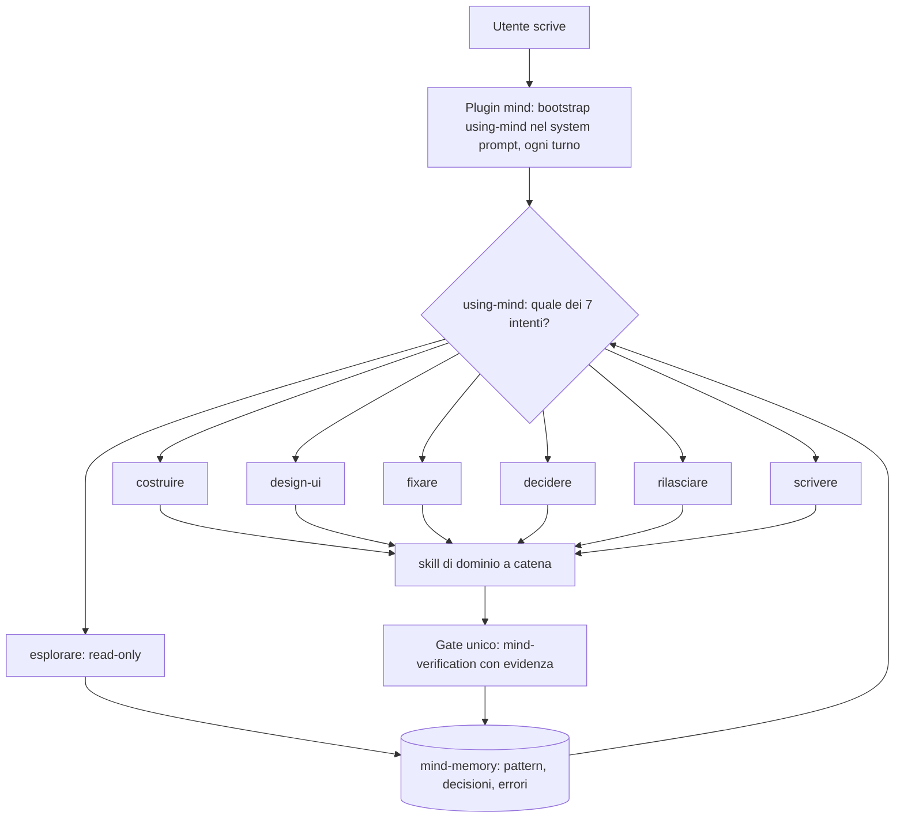
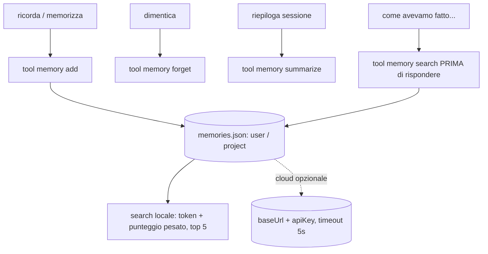

# mind-system

Sistema mind: skill + orchestrazione + memoria per **opencode**.

Orchestratore a 7 intenti, 47 skill di dominio, Design Track first-class, un solo gate di verifica, memoria locale-first. Funziona con DeepSeek, Qwen e Muse.

> I diagrammi sono **Mermaid** (GitHub li renderizza da solo). Dettaglio operativo dell'orchestratore in `skills/mind/using-mind/` (`SKILL.md` + `routing.md`).

## Versioni

| Versione | Dove | Cosa |
|---|---|---|
| **v2.0** (corrente, `main`) | questo repo | Orchestratore snello: 7 intenti, 5 precedenze, budget rigido, 1 gate. Le skill di dominio sono invariate |
| **v1.0** | [Releases](../../releases/tag/v1.0) | Sistema precedente (tabella ~50 rotte, 17 precedenze) — zip scaricabile, congelata per sempre |

## Come funziona (in 30 secondi)



Il plugin `mind` inietta il bootstrap a ogni turno (con guardia anti-duplicazione), registra le skill usate in `gaps/skills-used.json` e non fa rete (niente lentezza all'avvio). L'orchestratore dichiara la rotta in una riga (`INTENT=x → STAGE=… → GATE=verification`), invoca le skill a catena annunciando `Uso <skill> per <scopo>`, chiude con evidenza e salva in memoria.

## Struttura

- `skills/mind/` — il fork mind: orchestratore `using-mind` (`SKILL.md` + `routing.md` + `fma-agents.md`) e 46 skill di dominio
- `skills/<altre>` — skill storiche: context7-mcp, design-md, design-system, ecosystem-health-check, execution-hygiene, frontend-design, motion, orchestrator, stop-slop
- `plugins/` — `mind.js` (bootstrap + registrazione skill + tracciamento uso) e `mind-memory.js` (memoria locale-first). Vanno al top di `~/.config/opencode/plugins/`
- `config/` — `opencode.jsonc`, `mind-memory.json`, `AGENTS.md` + subagent custom (`agents/sage.md`, `lust.md`, `forge.md`). Chiavi come `{env:VAR}` dall'ambiente all'avvio
- `docs/` — appunti e note decisionali
- `sync.ps1` — sincronizza **repo → macchina locale** (il repo è la source of truth)

## Quickstart

```powershell
git clone https://github.com/Kyriga-CGX/mind-system.git
cd mind-system
.\sync.ps1            # repo -> ~/.config/opencode + ~/.agents/skills (con .bak dei file esistenti)
.\sync.ps1 -WhatIf    # anteprima senza copiare
setx CONTEXT7_API_KEY "<valore>"   # poi riapri il terminale e riavvia opencode
```

## I 7 intenti

> I 7 intenti sono le **porte d'ingresso**, non il sistema: dietro ci sono 47 skill, 16 pipeline, 23 agenti e 1 gate. Niente è stato rimosso dalla v1 — la ricchezza è nel catalogo qui sotto.

| # | Intent | Rotta | Esempio |
|---|---|---|---|
| 1 | `costruire` | spec → piano → implementazione → verification | "aggiungi login OAuth" |
| 2 | `design-ui` | Design Track → verification | "card pricing con hover" |
| 3 | `fixare` | debugging (root cause + test) → fix TDD → verification | "crash su checkout" |
| 4 | `esplorare` | explore (digest) → docs? → memoria, read-only | "come funziona l'auth?" |
| 5 | `decidere` | consult/research → ADR/piano → codice solo se approvato | "quale ORM?" |
| 6 | `rilasciare` | release / devops / incident → verification | "v1.2.0", "produzione giù" |
| 7 | `scrivere` | docs / copy / i18n / data → verification | "README API", "traduci in EN" |

Se ambiguo: route conservativa (creativo→costruire, anomalia→fixare, domanda→decidere). Se sbagliata, si rifà. Pipeline multi-stage **solo** se consegna unica + ≥3 stage + stato su file — altrimenti rotta singola.

## Catalogo skill (tutte, per uso)

### Costruire: idea → piano → codice

| Skill | Cosa fa | Quando si usa |
|---|---|---|
| `mind-brainstorming` | Esplora intento e requisiti prima di scrivere codice | PRIMA di qualsiasi lavoro creativo |
| `mind-planning` | Converte spec approvata in piano eseguibile senza placeholder | piano multi-step pronto da eseguire |
| `mind-implementation` | TDD + dispatch di N subagent in parallelo (uno per unità) | implementare feature, bugfix, piani |
| `mind-api` | Contratti REST/GraphQL, versioning, consumo terze parti | endpoint e integrazioni (con `mind-security` se auth/dati sensibili) |
| `mind-testing` | Strategia e scrittura test (unit, integration, e2e), TDD | ogni codice che richiede test |
| `mind-refactor` | Refactoring senza cambio stack | pulire, semplificare, deduplicare |
| `mind-git` | Branching, commit atomici, worktree per subagent paralleli | versionamento e parallelismo isolato |

### Fixare: bug, sicurezza, performance, dati

| Skill | Cosa fa | Quando si usa |
|---|---|---|
| `mind-debugging` | Root cause PRIMA del fix + bug hunting proattivo | OGNI bug o comportamento inatteso |
| `mind-security` | Threat modeling, breach, hardening | auth, dati sensibili, pagamenti, rete, input utente |
| `mind-performance` | Misura PRIMA, ottimizza dove indica il profiler, rimisura | lentezza, bundle, query lente, latenza |
| `mind-data` | Query, schema, ETL, backup/restore, data quality | DB, dataset, report, import/export |
| `mind-migration` | Upgrade e cambi stack incrementali con rollback | versioni, framework, migrazioni codice |

### Design e grafica: direzione → token → motion → QA

| Skill | Cosa fa | Quando si usa |
|---|---|---|
| `frontend-design` | Direzione estetica: personalità, signature element, restraint | PRIMA di qualsiasi UI |
| `design-system` | Crea/applica `DESIGN.md`, enforce token `var(--*)`, anti-slop 9 check, WCAG 4.5:1 | token, stili, design system |
| `motion` | Ladder anti-3D (CSS→WAAPI→Motion→GSAP→SVG→Three.js), 3 strati, stagger <500ms | animazioni e movimento |
| `mind-design-explore` | 2-3 direzioni visive distinte + scelta utente | serve un concept prima di costruire |
| `mind-copy` | Copy con tono/audience/obiettivo + pulizia `stop-slop` | landing, email, CTA, microcopy |
| `stop-slop` | Rimuove i pattern AI dal testo | pulizia prosa esistente |
| subagent `lust` | Design QA read-only in contesto fresco (token, anti-slop, a11y, responsive) | review visiva finale — MAI chi ha implementato |

### Decidere: ricerca, architettura, consulenza

| Skill | Cosa fa | Quando si usa |
|---|---|---|
| `mind-research` | Comparazioni con fonti verificate (mai senza fonti) | scelta libreria/framework/best practice |
| `mind-architecture` | ADR e trade-off registrati | decisioni architetturali |
| `mind-consult` | Parere strategico via subagent `sage` (Van Hohenheim) | "cosa mi consigli", "come miglioreresti" — NON costruisce |
| `context7-mcp` | Documentazione aggiornata di librerie e SDK | domande su API e framework |
| `mind-explore` | Codebase Digest di codice sconosciuto | onboarding, impatto di un cambio |

### Rilasciare: versioni, deploy, incidenti

| Skill | Cosa fa | Quando si usa |
|---|---|---|
| `mind-release` | Semver, changelog, tag, note | pubblicare una versione |
| `mind-devops` | Build, CI/CD, Docker, deploy, rollback pronto | pipeline e ambienti |
| `mind-incident` | Triage, mitigazione, postmortem in `docs/incidents/` | produzione giù o degradata |
| `mind-i18n` | Chiavi, struttura, test per lingua | localizzazione e nuove lingue |
| `mind-docs` | README, API docs, guide verificate sul codice | documentazione tecnica |
| `mind-documents` | Crea/legge PDF, DOCX, XLSX, PPTX | task su documenti |

### Sistema e meta: memoria, autonomia, miglioramento

| Skill | Cosa fa | Quando si usa |
|---|---|---|
| `mind-memory` | Salva/recupera pattern, decisioni, errori (tool `memory`) | fine rotta + richiami ("come avevamo fatto") |
| `mind-recall` | RAG read-only sullo storico sessioni (cita la fonte) | quando `memory` non basta |
| `mind-setup` | Prima configurazione (domande una alla volta → working-set) | primo messaggio su progetto nuovo |
| `mind-runner` | Esegue un piano per intero in autonomia (coda su file, checkpoint, max 10 iter, stop a 3 fail) | "finisci da solo", obiettivi multi-sessione |
| `mind-eval` | Valuta prompt/agenti/skill con report | la skill scatta ma rende male |
| `mind-forge` | Forgia nuove skill/agenti via subagent Sheska (solo con approvazione) | caso ricorrente non coperto da nessuna skill |

## Flussi d'uso (come si lavora davvero)

### Implementare una feature

```mermaid
sequenceDiagram
    participant O as Orchestratore
    participant B as brainstorming
    participant P as planning
    participant E as Edward (unità 1)
    participant A as Alphonse (unità 2)
    participant R as Riza (review)
    participant V as verification
    O->>B: intent + requisiti
    B-->>O: spec approvata (docs/specs/...)
    O->>P: spec
    P-->>O: piano (header + task, no placeholder)
    O->>O: review piano vs spec + mappa file
    O->>E: unità 1 (input, output, done criteria)
    O->>A: unità 2 (file disgiunti)
    E-->>O: DONE
    A-->>O: DONE
    O->>R: diff → fix-loop (R≤3 stesso subagent, R≥4 Mustang)
    R-->>O: ok
    O->>V: test + lint + evidenza fresca
    V-->>O: verde → memoria (pattern, decisioni)
```



### Fixare un bug / rispondere a un breach

```mermaid
flowchart TD
    BUG[Bug / comportamento inatteso] --> DBG[mind-debugging: root cause + test che fallisce]
    DBG --> FIX[mind-implementation TDD: il test guida il fix]
    FIX --> REG[regression check: il vecchio resta verde]
    REG --> G[mind-verification]
    SEC{Breach / dati sensibili?} -->|sì| TH[mind-security: threat model PRIMA del codice]
    TH --> FIX
    PROD{Produzione giù?} -->|sì| INC[mind-incident: triage → mitigazione → root cause → postmortem]
    INC --> G
```



Regola d'oro: mai fix sui sintomi. Il test che fallisce è l'input del fix, non un optional.

### Grafica: dalla direzione alla QA

```mermaid
flowchart TB
    R[richiesta UI] --> DIR[frontend-design: personalità, signature, restraint]
    DIR --> TOK[design-system: DESIGN.md + token CSS + anti-slop]
    TOK --> MO{motion serve?}
    MO -->|sì| MOT[motion: livello più basso che basta, mai 3D di default]
    MO -->|no| QA
    MOT --> QA[Lust read-only: token? anti-slop? a11y AA? responsive?]
    QA -->|FAIL| TOK
    QA -->|PASS| G[mind-verification + DESIGN.md aggiornato]
```



Per lavori strutturati (nuova UI, redesign, identità visiva) la Design Squad lavora in parallelo sui 12 stage di `mind-design-pipeline` con 2 gate utente (direzione e mockup). Nessun codice prima del mockup approvato.

### Testing e QA

- `mind-testing` definisce la strategia (unit/integration/e2e) e scrive i test; il refactoring parte solo con baseline verde.
- Bug hunting proattivo: `mind-debugging` (sezione dedicata) → `mind-testing` → verification.
- UI: visual regression + a11y nella QA di Lust, poi gate finale.
- i18n: `mind-i18n` aggiunge test per lingua, verification chiude.

### Ricerca e decisioni

`mind-research` (+ `context7-mcp`) raccoglie fonti → sintesi per opzione → comparazione → raccomandazione documentata. Se serve un parere strategico: `mind-consult` (sage). Se impatta l'architettura: `mind-architecture` (ADR) come vincolo del piano. Il codice parte solo dopo l'approvazione.

### Rilasciare

`mind-release` (semver + changelog + tag) → `mind-devops` (build CI verde + rollback pronto) → verification. Rollout graduale di feature pronta: flag off → canary → A/B → 25→50→100% con metriche e baseline.

## Pipeline di dominio (quando servono)

Regola unica: pipeline **solo** se consegna unica + ≥3 stage + stato su file (`.mind/delivery/<nome>/state.json`). Solo mockup e contratti critici richiedono approvazione utente; il resto fila. Ogni pipeline riusa le skill singole e chiude su `mind-verification`.

| Pipeline | Stage | Trigger |
|---|---|---|
| `mind-pipeline` | mockup→approvazione→contratti→FE→BE→integrazione→sicurezza→test→gate→memoria | feature UI+BE+integrazione end-to-end |
| `mind-incident-pipeline` | detection→triage→mitigazione→root cause→stabilità→postmortem→hardening | incidente/breach strutturato |
| `mind-security-audit-pipeline` | scope→threat model→input→auth→dipendenze→test→report→remediation | audit pre-release/post-breach |
| `mind-migration-pipeline` | delta→piano+rollback→dry-run→fasi→verifica→cutover→monitoraggio | migrazione complessa A→B |
| `mind-release-pipeline` | cambiamenti→semver→changelog→CI→tag→publish→rollback | chiusura ciclo feature→deploy |
| `mind-onboarding-pipeline` | setup→digest→convenzioni→architettura→baseline→primi task | progetto/codebase nuovo |
| `mind-research-pipeline` | domanda→fonti→sintesi→comparazione→raccomandazione→validazione | ricerca documentata |
| `mind-data-pipeline` | estrazione→pulizia→validazione→trasformazione→caricamento→verifica→docs | ETL complesso (backup prima) |
| `mind-performance-pipeline` | baseline→profiling→bottleneck→ottimizzazione→verifica→monitoraggio | intervento performance (stesso strumento prima/dopo) |
| `mind-mobile-pipeline` | stack→design→contratti→FE→BE→device→test→signing→release→gate | app cross-platform fino allo store |
| `mind-infra-pipeline` | scope→IaC→rete→secrets→immagini→orchestrazione→DNS→scaling→costi→monitor | ambiente cloud end-to-end |
| `mind-observability-pipeline` | inventario→logging→metriche→tracing→alerting→dashboard/SLO→verifica | monitoring di un sistema |
| `mind-ml-pipeline` | problema→dati→feature→modello→training→eval→deploy→drift | ciclo ML completo |
| `mind-feature-rollout-pipeline` | flag→metriche→canary→A/B→espansione→cleanup→post-verifica | attivazione graduale misurata |
| `mind-decommission-pipeline` | inventario→impatto→deprecation→avvisi→migrazione→shutdown→cleanup | ritiro servizio/feature |
| `mind-design-pipeline` | brief→audit→direzioni→DESIGN.md→mockup→componenti→motion→copy→FE→QA→gate→memoria | design strutturato (2 gate utente) |

## Agenti FMA (chi esegue)

| Ruolo | Personaggio | Verbo | Emoji | Quando |
|---|---|---|---|---|
| Implementer principale | Edward Elric | `aequiparo` | ⚗� | default implementazione |
| Implementer supporto | Alphonse Elric | `protego` | 🛡� | secondo subagent parallelo |
| Implementer robusto | Alex L. Armstrong | `fabricor` | 💪 | task pesanti multi-file |
| Implementer veloce | Lan Fan | `percurro` | 🌀 | task piccoli |
| Fix meccanici | Winry Rockbell | `calibro` | 🔧 | riparazioni puntuali |
| Debugging | Scar | `disicio` | 💥 | root cause |
| Ricerca | Ling Yao | `exploro` | � | `mind-research` |
| Performance | Greed | `accumulo` | 💰 | `mind-performance` |
| Review/escalation | Roy Mustang | `inuro` | 🔥 | fix-loop R≥4 |
| Verifica | Riza Hawkeye | `recenseo` | 🎯 | `mind-verification` |
| Test | Izumi Curtis | `exigo` | 🌊 | `mind-testing` |
| Docs | Maes Hughes | `adnoto` | 📓 | `mind-docs` |
| Gate qualità | Olivier Armstrong | `obsigno` | �� | gate finale |
| Consulenza (Sage) | Van Hohenheim | `pondero` | 🧭 | `mind-consult` |
| Maker (forge) | Sheska | `compilo` | 📚 | `mind-forge` |
| Arbitro | King Bradley | `dirimo` | ⚔� | conflitti subagent |
| Direzioni design | Isaac e Miria | `divago` | 🎨 | concept distinti |
| IA / user flow | Heymans Breda | `dispono` | 🗺� | struttura contenuti |
| Componenti/token | Pinako Rockbell | `elaboro` | 🛠� | craft su DESIGN.md |
| Responsive/temi | Envy | `transformo` | 🦎 | breakpoint e dark mode |
| Microcopy | Jean Havoc | `dico` | 💬 | CTA, errori, label |
| Accessibilità | Maria Ross | `protego` | ♿ | contrasto, focus, label |
| Design QA | Lust | `scrutor` | �� | review read-only (`config/agents/lust.md`) |

Il nome ruota a ogni dispatch (prompt + report), il verbo latino sostituisce "sto pensando", l'emoji è la firma. Una battuta anime ogni tanto, max una per subagent.

## Memoria (mind-memory)



Storage in `~/.local/share/opencode/mind-memory/memories.json`, mai bloccante. **Non è RAG**: niente embedding, solo lessicale (un futuro RAG manterrebbe l'interfaccia invariata).

## Comunicazione tra skill (cosa passa di mano)

Ogni skill passa il suo **risultato** come input alla successiva; se manca o è placeholder, si torna indietro invece di proseguire.

| Da | A | Cosa passa |
|---|---|---|
| brainstorming | planning | spec approvata (`docs/specs/...`) |
| planning | implementation | piano (header + task) |
| debugging | implementation | root cause + test che fallisce |
| security | implementation | threat model e vettori |
| research | planning/implementation | raccomandazione con fonti |
| performance | implementation | baseline + collo di bottiglia |
| data | implementation | schema/query verificate |
| testing | implementation | strategia + test (TDD) |
| migration | implementation | delta + punto di rollback |
| refactor | debugging/migration/testing | bug emerso / upgrade / baseline verde |
| api | security/docs/migration | threat model / contratto / breaking change |
| release | devops/verification | build/publish / gate verde |
| explore | docs/memory | Codebase Digest → docs/mappa |
| architecture | planning/api/security/migration | ADR come vincolo |
| copy | stop-slop/frontend-design/memory | pulizia → estetica → tono |
| incident | debugging/security/devops/docs | root cause / breach / rollback / postmortem |
| i18n | implementation/testing/verification | chiavi → test per lingua → evidenza |
| eval | orchestratore | report → modifiche (eval prima/dopo) |
| forge | orchestratore/recall/eval/routing | lacuna → proposta (gate) → skill nuova → verifica |
| design-pipeline | explore/design-system/motion/implementation/QA | direzione, DESIGN.md, mockup, qualità verificata |
| planning | runner | piano → coda persistente + checkpoint |
| qualunque rotta | verification | gate finale con evidenza |
| qualunque rotta | memory | pattern, decisioni, errori |

## Regole (precedenze, budget, gate)

1. Istruzioni utente > tutto. 2. Sicurezza prima del codice sensibile. 3. Design: direzione → token → motion. 4. Un task = una rotta; parallelo solo a file disgiunti. 5. `mind-verification` unico gate.
- Budget: max 3 subagent, max 10 iterazioni, stop a 3 fail. Review piano-vs-spec prima del dispatch. Regression check su codice esistente. Delivery in fasi per feature grandi. Design debt check post-UI.
- Proattività: gap/rischi/miglioramenti → domanda con opzioni PRIMA di agire. Artefatti come link `file://` assoluti.
- Lacune: routing sbagliato → correggi `routing.md`; skill scadente → `mind-eval`; caso non coperto → `mind-forge` (mai senza approvazione).

## Sviluppo e rollback

- Il repo è la source of truth: si lavora qui, `sync.ps1` allinea il locale.
- Rollback: ogni release è un tag — la [v1.0](../../releases/tag/v1.0) resta scaricabile con il suo zip.
